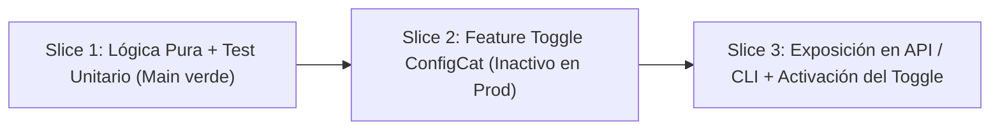

# 📘 Scrum + Trunk-Based Development (TBD) Playbook

Este playbook establece los acuerdos operativos, roles, reglas de integración y definición de terminado (DoD) para trabajar con **Trunk-Based Development (TBD)** y **Continuous Deployment (CD)** en nuestro equipo.

---

## 1. Diagnóstico del Flujo Actual (Resumen)
* **Flujo:** `Commit Local` ➔ `PR` ➔ `CI (Ruff + Pytest)` ➔ `Code Review` ➔ `Merge a main` ➔ `Docker Image (GHCR)` ➔ `Deploy`.
* **Fricciones detectadas:**
  1. Ramas de larga duración generan conflictos de integración ("Merge Hell").
  2. Bloqueos por espera de aprobación en Pull Requests.
  3. Despliegue manual desacoplado de la rama `main`.
  4. Miedo a romper producción por falta de interruptores de funcionalidad (*Feature Flags*).

---

## 2. Roles Adaptados a TBD + Continuous Deployment

| Rol | Responsabilidad Tradicional | Nueva Responsabilidad en TBD + CD |
| :--- | :--- | :--- |
| **Product Owner (PO)** | Define qué construir en sprints de 2-3 semanas; espera a la Review para validar. | • Participa activamente en el **Story Slicing** (rebanado fino de historias en entregas de <24h). • Prioriza por valor, tamaño de batch y riesgo de despliegue. • Gestiona el ciclo de vida de los **Feature Toggles** (decide cuándo activar una función a los usuarios). |
| **Developers** | Desarrollan en ramas aisladas durante días; integran al final del sprint. | • **Ownership colectivo del pipeline:** Si `main` se rompe (rojo), detener todo hasta arreglarlo. • Integrar código a `main` al menos **una vez al día** en lotes muy pequeños. • Escribir pruebas unitarias automatizadas antes o junto con el código (TDD / CI verde). |
| **Scrum Master** | Facilita ceremonias clásicas y monitorea velocidad del sprint. | • Elimina el miedo a integrar directamente a `main`. • Facilita la disciplina diaria de ramas cortas y resolución inmediata de cuellos de botella en CI. • Protege tiempo del equipo para mejorar y acelerar el pipeline de CI/CD. |

### 📌 Compromisos Prácticos ("Post-its del equipo")
* **Post-it PO:** *"A partir de mañana no escribiré historias de más de 1 día de desarrollo; las dividiré junto con el equipo usando Feature Toggles para que se puedan subir a producción apagadas."*
* **Post-it Developer:** *"A partir de mañana ninguna de mis ramas vivirá más de 24 horas; integraré cambios pequeños y mantendré la suite de tests siempre en verde."*
* **Post-it Scrum Master:** *"A partir de mañana la prioridad número 1 de la Daily no será 'qué hice ayer', sino 'qué cambio vamos a integrar hoy a main de forma segura'."*

---

## 3. Adaptación de Artefactos y Ceremonias

| Artefacto / Ceremonia | Versión Clásica Scrum | Adaptación TBD + CD |
| :--- | :--- | :--- |
| **Product Backlog** | Lista de grandes historias priorizadas por negocio. | Historias rebanadas (*sliced*) en incrementos de 1 día + estrategia de Feature Flags + Criterios de Aceptación verificables en producción. |
| **Sprint Backlog** | Paquete cerrado de trabajo comprometido para 2 semanas. | Flujo continuo de tareas que se planea integrar a `main` diariamente en pequeños lotes. |
| **Incremento** | Paquete de software entregable al finalizar el sprint. | **Cada commit que pasa el CI en `main` es un Incremento potencialmente desplegable.** |
| **Daily Scrum** | Tres preguntas: ¿Qué hice ayer? ¿Qué haré hoy? ¿Qué impedimentos tengo? | Enfoque en flujo continuo: **¿Qué voy a integrar hoy a `main`? ¿El pipeline está verde? ¿Qué necesito para que mi cambio sea seguro en producción?** |
| **Sprint Review** | Demostración formal de lo completado en un ambiente de pruebas. | Inspección de lo que **ya está en producción** (o activo para usuarios piloto mediante flags) y recolección de métricas de uso real. |
| **Sprint Retrospective** | Conversación sobre dinámicas humanas y estimaciones. | Análisis de la **salud del pipeline**, tiempo de ciclo (*Lead Time*), frecuencia de despliegue y disciplina para evitar ramas largas. |

---

## 4. Ejercicio Práctico de Sliceado (Story Slicing)

### Historia de Usuario Base:
> **HU-01:** *"Como usuario del sistema de cálculo de estado anímico, quiero calcular la multiplicación de factores de felicidad de los chanchitos para proyectar el bienestar semanal."*

### Rebanado en 3 Slices para TBD (< 24 horas cada uno):

1. **Slice 1 (Día 1 - Back-end / Core):**
   * Implementación de la función `multiplicacion(a, b)` en `Calculator` con test unitario en `test.py`.
   * Pasa Ruff y Pytest. Se integra a `main`. No afecta la interfaz pública.
2. **Slice 2 (Día 2 - Feature Flag):**
   * Integración de la bandera condicional (Feature Toggle con ConfigCat o variable de entorno).
   * La funcionalidad viaja a producción **apagada por defecto** (`is_feature_enabled = False`).
3. **Slice 3 (Día 3 - Entrega al Usuario):**
   * Conexión con el endpoint o CLI final. El PO activa la bandera en el dashboard sin necesidad de recompilar ni redesplegar código.

---

## 5. Reglas de Oro de Integración a Main (TBD Golden Rules)
1. **Vida de rama máxima de 24 horas:** Ningún branch debe permanecer más de un día sin integrarse a `main`.
2. **Main siempre verde y desplegable:** Si el pipeline de CI falla tras un merge, el equipo detiene tareas nuevas y repara `main` o revierte el cambio en menos de 10 minutos.
3. **Tests locales obligatorios antes de push:** Ejecutar siempre `ruff check .` y `pytest` localmente antes de enviar cambios.
4. **Desacoplar Deploy de Release:** El código incompleto se sube a producción oculto tras un **Feature Toggle**. Desplegar código ya no significa habilitarlo al cliente.
5. **Cambios en lotes pequeños (Small Batches):** Commits atómicos de 50 a 200 líneas de código, fáciles de revisar y sin riesgo de conflicto.

---

## 6. Definition of Done (DoD) Preliminar

Un ítem de trabajo se considera **DONE (Terminado)** únicamente cuando cumple:
* [x] **Criterio Técnico:**
  * Pruebas unitarias escritas con cobertura adecuada.
  * Linter (`ruff`) sin advertencias ni errores.
  * Pipeline de CI ejecutado exitosamente en GitHub Actions (todos los checks en verde).
  * Imagen Docker construida y publicada en el registro de contenedores (`ghcr.io`).
  * En caso de funcionalidad en desarrollo, protegida por un Feature Flag inactivo.
* [x] **Criterio de Negocio:**
  * Criterios de Aceptación verificados por el Product Owner en ambiente real o mediante flag de prueba.
  * Telemetría o logs básicos configurados para monitorear el comportamiento en producción.
  * Documentación o notas de versión actualizadas.

---

## 7. Decisiones Técnicas Pendientes
* **Gestor de Feature Flags:** Se seleccionó **ConfigCat** por su soporte nativo en Python, interfaz amigable para el PO y capa gratuita para equipos ágiles.
* **Métricas DORA a implementar:**
  1. *Deployment Frequency* (Frecuencia de despliegue a producción).
  2. *Lead Time for Changes* (Tiempo desde el commit hasta producción).
  3. *Change Failure Rate* (Porcentaje de despliegues que causan incidentes).
  4. *Time to Restore Service* (Tiempo de recuperación ante fallos).
